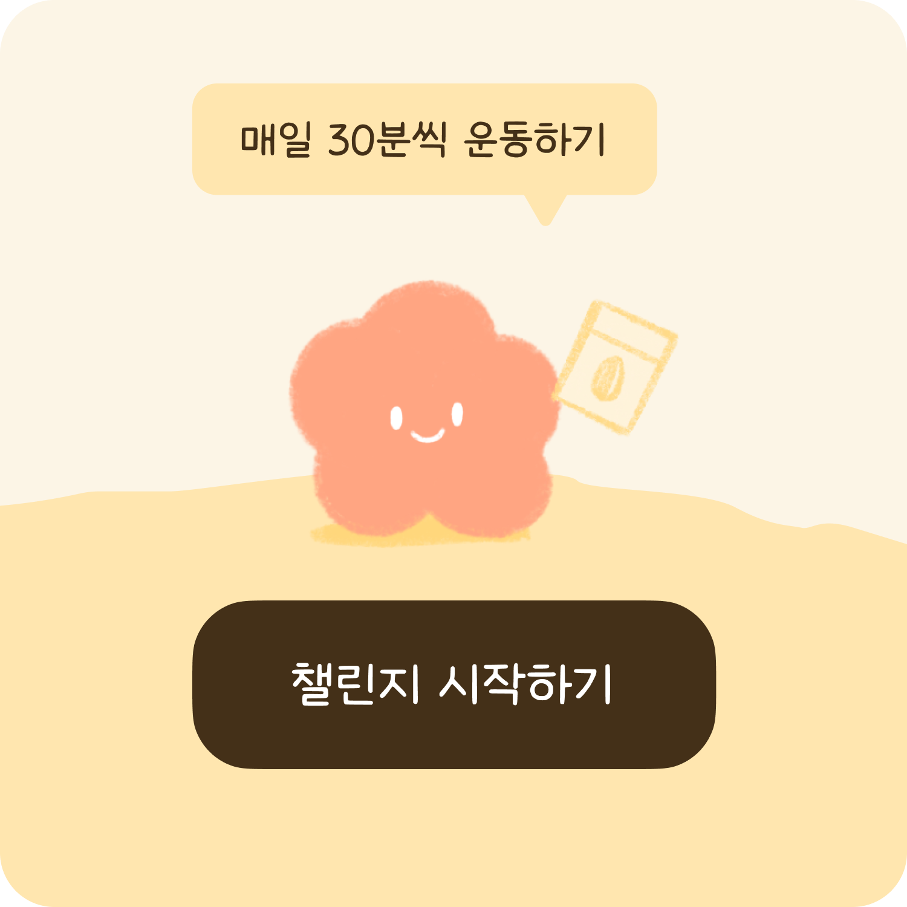
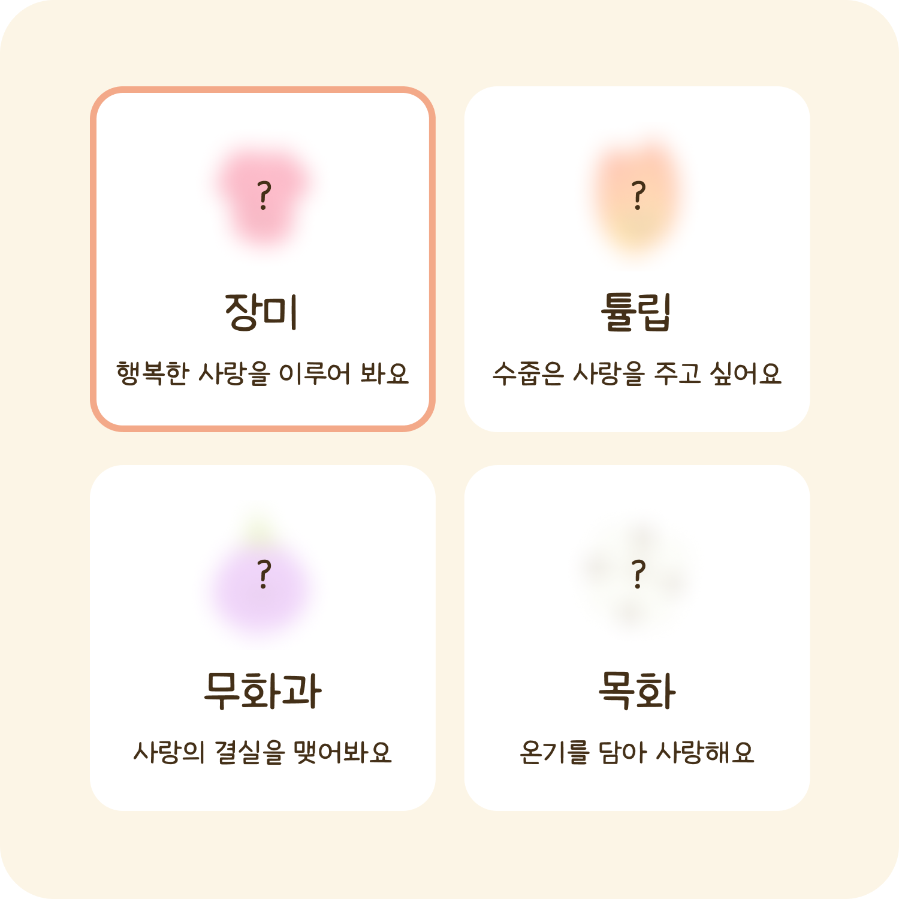
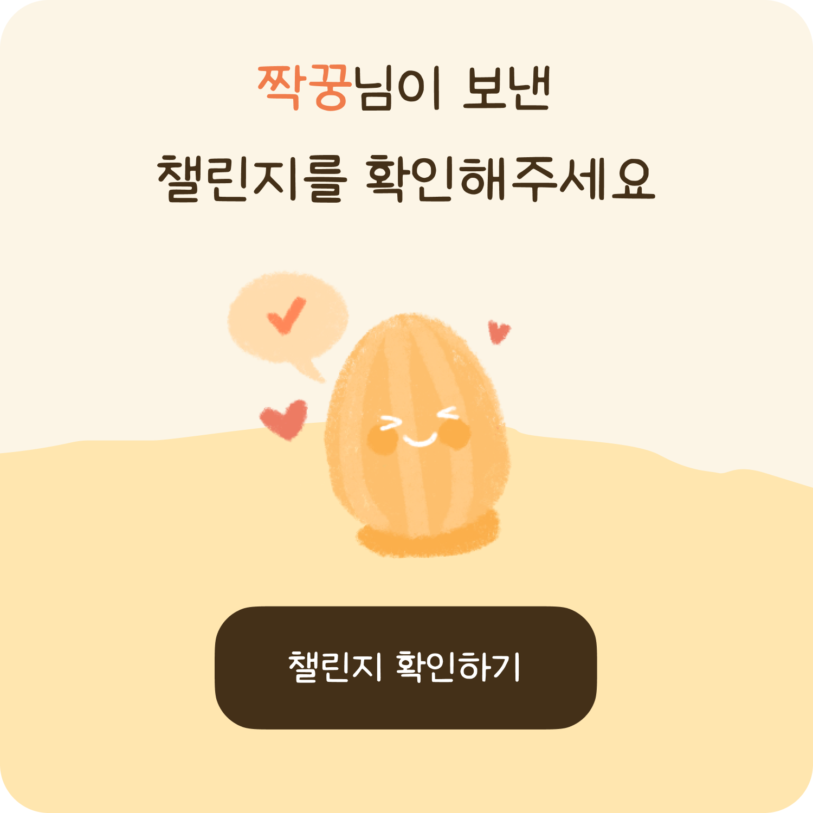
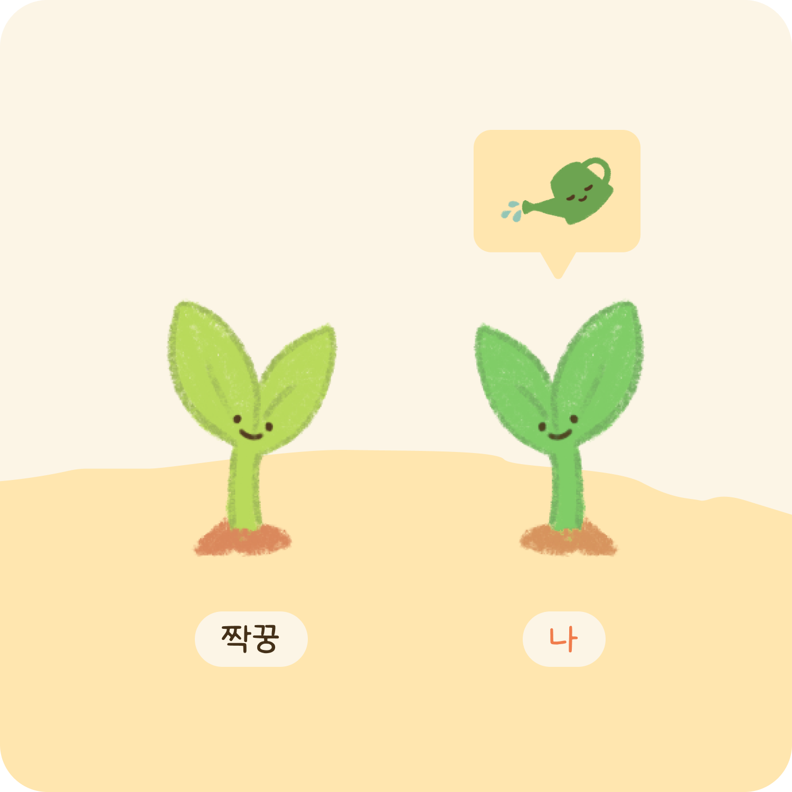
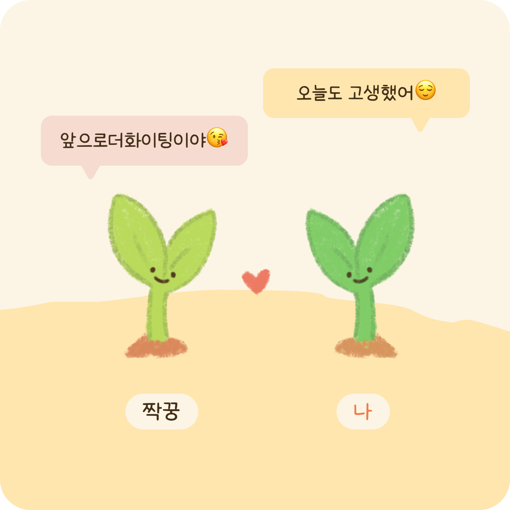
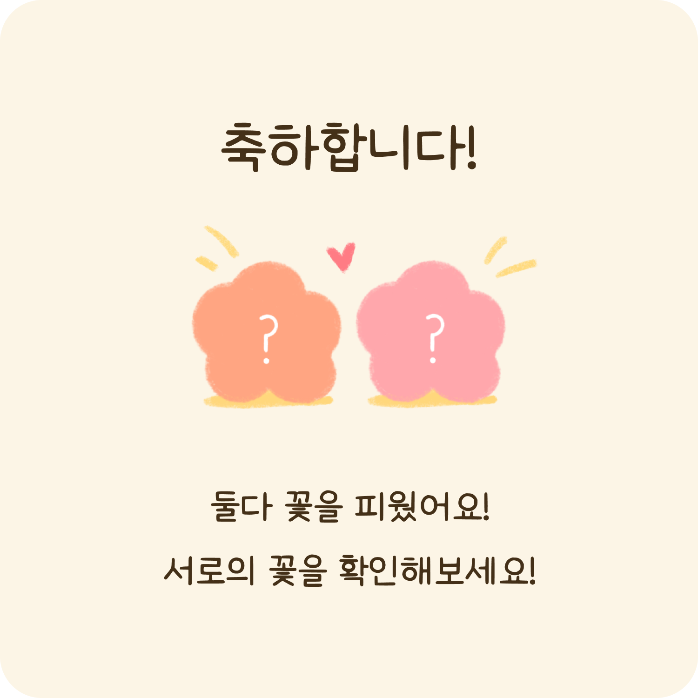
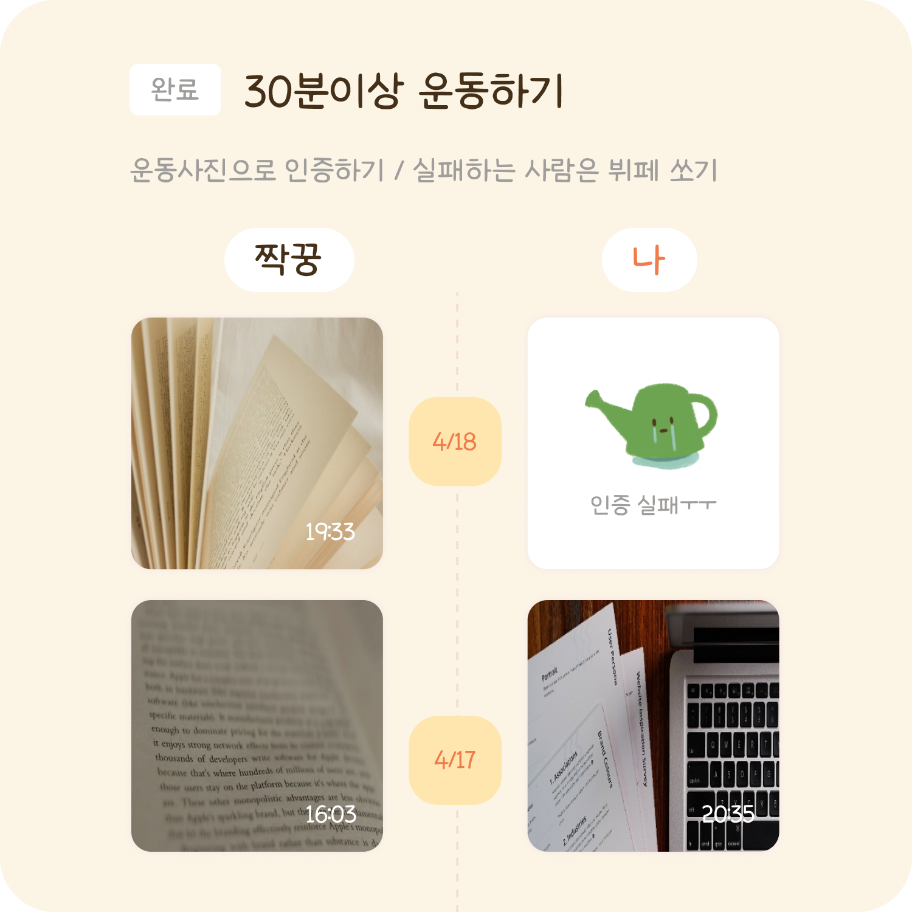
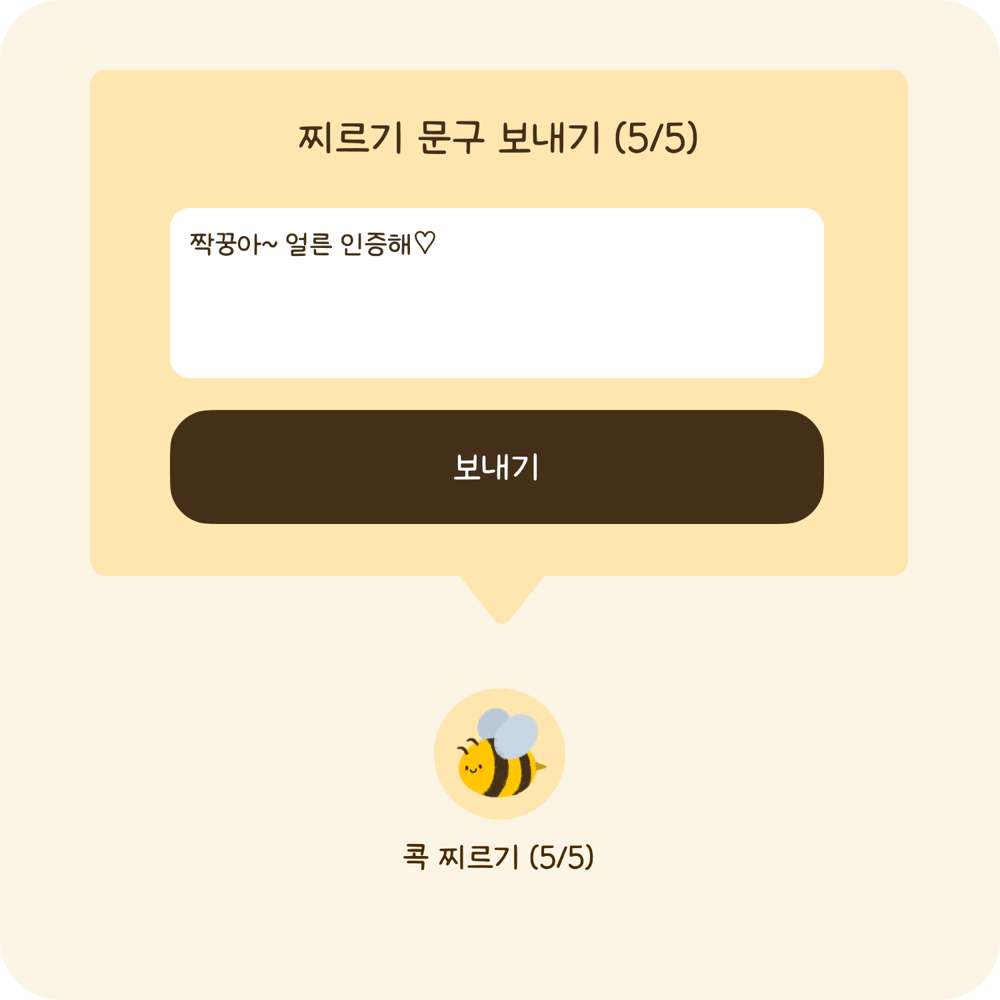

- STEP 1
  - 짝꿍과 함께 달성할 챌린지를 만들어주세요
  - 서로에게 선물할 꽃을 골라주세요
  - 짝꿍이 수락버튼을 눌러야 챌린지를 시작할 수 있어요 
- STEP 2
  - 매일 한번씩 꽃에 물을 주며 인증해보세요
  - 짝꿍이 인증을 안했다면 ‘콕 찌르기’를 통해 알림을 보내보세요
- STEP 3
  - 서로 인증을 완료하면 칭찬을 남겨보세요
- STEP 4
  - 22일 챌린지를 완료해요
- STEP 5
  - 히스토리에서 지금까지 진행했던 챌린지를 살펴봐요

안녕하세요! 너와 내가 함께 성장하는 과정, TwoToo입니다 :)

TwoToo는 연인과 함께하는 챌린지, 기록 앱 입니다.

새로운 행동이 습관화 되는데 최소 21일이 걸린다고합니다.
TwoToo는 최소한의 목표 달성기간 22일을 기준으로 챌린지를 생성할 수 있습니다.

# STEP 1

## 짝꿍과 함께 달성할 챌린지를 만들어주세요

*   22일간 진행할 챌린지 내용을 입력해주세요.
*   구체적인 룰, 벌칙등을 함께 작성해 재밌는 챌린지를 만들어봐요.
*   투투에서 추천하는 챌린지를 시작해봐도 좋아요.

## 짝꿍과 함께 달성할 챌린지를 만들어주세요

*   챌린지를 입력할때 서로에게 주고 싶은 꽃의 씨앗을 같이 보내요.
*   각자 서로에게 받은 꽃을 키우면서 챌린지를 종료했을 때 무슨 꽃인지 확인 할 수 있어요.

### 짝꿍이 수락버튼을 눌러야 챌린지를 시작할 수 있어요

*   투투는 양쪽 모두가 수락해야 챌린지를 시작할 수 있어요
*   만약 시작일이 지나도 수락하지 않는다면, 새로운 챌린지를 생성해야되요.(시작일이 지나면 수락할 수 없으니 기간 내에 수락해 주세요!)

# STEP 2

## 매일 한번씩 꽃에 물을 주며 인증해보세요

*   하루에 한 번 인증하기를 통해 꽃에게 물을 줄 수 있어요.
*   인증을 진행할때는 사진이 필수에요.

## 짝꿍이 인증을 안했다면 ‘**콕 찌르기**’를 통해 알림을 보내보세요

*   콕 찌르기는 하루 최대 5번만 할 수 있어요.
*   짝꿍에게 보내고 싶은 문구를 써서 알림을 보내보세요! _ex) 짝꿍아 얼른 인증해♡_

# STEP 3

## 서로 인증을 완료하면 칭찬을 남겨보세요

*   짝꿍과 내가 모두 인증에 성공하면 서로의 인증에 칭찬을 남길 수 있어요.
*   상대방의 인증에 칭찬을 남겨봐요 _ex) 오늘 하루도 고생했어ㅎㅎ_

# STEP 4

## 22일 챌린지를 완료해요

*   22일간 진행한 짝궁과의 챌린지를, **다음날 완료하기 버튼**을 눌러 챌린지를 완료해요.
*   80%이상 인증했다면 짝꽃 이주꽃 을 볼수 있답있니다.
*   23일에 완료를 하면 챌린지 히스토리 페이지에서 조회를 할 수 있어요.

# STEP 5

## 히스토리에서 지금까지 진행했던 챌린지를 살펴봐요

*   왼쪽 **히스토리 탭**에서 지금까지 진행한 챌린지를 볼 수 있어요
*   과거에 어떤 챌린지를 진행했고 어떤 마음으로 진행했는지 확인해봐요

